---

## AI Sports Commentator

An end‑to‑end, real‑time **AI commentary system** that transforms live match feeds into dynamic, immersive play‑by‑play narration. Built initially for **cricket**, it leverages **web scraping**, **vector databases**, and an **agentic LLM pipeline**—and is architected to support other major sports (football, basketball, tennis, etc.) with minimal changes.

---

### 🚀 Key Features

* **Live Match Discovery**
  Automatically scrape and list ongoing matches (IDs, teams, venues).

* **Event‑Level Data Extraction**
  Pull ball‑by‑ball (or event‑by‑event) details: runs, wickets, fouls, goals, points, etc.

* **Vectorized Data Storage**
  Ingest events into a **Pathway Vector Store** for ultra‑fast similarity search and contextual retrieval.

* **Agentic LLM Team**

  * **Commentary Generator**: Crafts real‑time, narrative‑style commentary.
  * **Stats Analyzer**: Queries vector store and external sources for contextual stats (player form, head‑to‑head history, record comparisons).

* **Extensible Architecture**
  Modular scrapers and LLM agents facilitate seamless support for additional sports.

---

## 🏗️ Architecture Overview

This diagram shows the end‑to‑end flow of our AI‑driven live sports commentary system:

```mermaid
flowchart TD
    %% ===========================================
    %% LIVE SPORTS COMMENTARY SYSTEM ARCHITECTURE
    %% ===========================================
    
    %% Top Row - Input Layer
    A[🌐 Live Sports Website<br/>Data Provider]
    B[🎯 Match Selector UI<br/>User Interface]
    C[🔄 Event Scraper Module<br/>Ball-by-ball Data Extraction]
    
    %% Middle Row - Processing & AI
    G[📺 Live Commentary Stream<br/>Real-time Broadcasting]
    subgraph LLM [" 🤖 Agentic LLM Pipeline "]
        direction TB
        E[📊 Stats Analyzer<br/>Performance Metrics]
        F[✍️ Commentary Generator<br/>Natural Language Output]
    end
    D[🗂️ Pathway Vector Store<br/>Event Indexing & Storage]
    
    %% ===========================================
    %% BOX FLOW PATTERN
    %% ===========================================
    
    %% Top Row: Left to Right
    A -->|"🔍 Scrape Match Data"| B
    B -->|"👤 User Selection"| C
    
    %% Right Side: Top to Bottom
    C -->|"⚡ Stream Events"| D
    
    %% Bottom Row: Right to Left (through AI)
    D -->|"🔎 Context Retrieval"| E
    E -->|"📈 Analysis"| F
    F -->|"🎙️ Commentary"| G
    
    %% ===========================================
    %% COMPONENT STYLING
    %% ===========================================
    
    class A source
    class B interface
    class C processor
    class D storage
    class LLM pipeline
    class E,F component
    class G output
    
    classDef source fill:#E3F2FD,stroke:#1976D2,stroke-width:3px,color:#000
    classDef interface fill:#E8F5E9,stroke:#388E3C,stroke-width:3px,color:#000
    classDef processor fill:#FFF3E0,stroke:#F57C00,stroke-width:3px,color:#000
    classDef storage fill:#F3E5F5,stroke:#7B1FA2,stroke-width:3px,color:#000
    classDef pipeline fill:#FFE0B2,stroke:#E65100,stroke-width:4px,color:#000
    classDef component fill:#FFCC80,stroke:#D84315,stroke-width:2px,stroke-dasharray: 5 5,color:#000
    classDef output fill:#FCE4EC,stroke:#C2185B,stroke-width:3px,color:#000
```



---

## ⚙️ Getting Started

1. **Clone the repo**

   ```bash
   git clone https://github.com/YourOrg/ai-sports-commentator.git
   cd ai-sports-commentator
   ```

2. **Configure credentials**
   Copy and update `config.example.py` → `config.py`:

   ```python
   # config.py

   # Language model API key (e.g., OpenAI / Gemini / Groq)
   LLM_API_KEY = "your_llm_api_key"

   # Pathway vector store license/key
   PATHWAY_LICENSE_KEY = "your_pathway_license_key"

   # (Optional) Web‑scraping user agent or proxy settings
   SCRAPER_CONFIG = {
       "user_agent": "YourApp/1.0",
       "proxy": None
   }
   ```

3. **Build & run with Docker**

   ```bash
   # Build
   docker build -f cricket_pipeline/Dockerfile -t ai-commentator:latest .
   # Run
   docker run -d -p 9000:9000 --env-file .env ai-commentator:latest
   ```

4. **Interact**

   * Open `http://localhost:9000`
   * Select a live match
   * Watch real‑time, AI‑generated commentary scroll by

---

## 🛠️ Core Modules

| Module                   | Responsibility                                             |
| ------------------------ | ---------------------------------------------------------- |
| **match\_scraper.py**    | Scrapes match list (IDs, schedule, teams, venues)          |
| **event\_scraper.py**    | Streams ball‑by‑ball (or event) data via HTTP/WebSocket    |
| **vector\_store.py**     | Ingests & indexes JSON‑serialized events into Pathway      |
| **agentic\_pipeline.py** | Coordinates Stats Analyzer ↔ Commentary Generator agents   |
| **ui\_server.py**        | Minimal Flask/FastAPI front‑end for match selection & view |

---

## 📈 Future Enhancements

1. **Personalization Engine**

   * User profiles: favorite teams, preferred commentary style (analytical, humorous).
   * Real‑time tone adjustment (e.g., ramp up excitement on close finishes).

2. **Deep Historical Context**

   * Bulk ingest of historical archives for advanced, narrative‑driven insights.
   * Automated record‑breaking alerts.

3. **Cross‑Sport Adaptability**

   * Plug‑and‑play scraper adapters per sport (soccer, basketball, tennis).
   * Sport‑specific event schemas (goals, fouls, corner kicks vs. runs, wickets, overs).

4. **Live Audio/Voice Integration**

   * Text‑to‑speech pipeline for a fully voice‑driven broadcast.
   * Multi‑language support via localized model prompts.

---

## 📄 License & Contribution

* **License**: MIT
* **Contributions**: Welcome! Please read [CONTRIBUTING.md](./CONTRIBUTING.md) for guidelines.

---

*Built with 💡, 🤖, and a passion for the game.*
